# Petsroom
The Petsroom is a social media platform for pet lovers. Here, users can share their bellowed pets photos, arrange meetup events with other users and share interesting articles relating animals that might interest other users. Users can also interact with each other by commenting on posts or events.

- The repository for the DRF-API associated with this project is available [HERE](https://github.com/DarkoZlatarek/petsroom-drf-api). The installation, set up, and deployment steps for this section of the project have been included in the README linked to the DRF-API. 

#### DEPLOYED BACKEND API PAGE - [LINK](https://petsroom-drf-api-11e537707187.herokuapp.com/)
#### DEPLOYED FRONTEND - [LIVE PAGE](https://petsroom-478d60bcd402.herokuapp.com/)
#### DEPLOYED FRONTEND - [REPOSITORY](https://github.com/DarkoZlatarek/project5-petsroom)

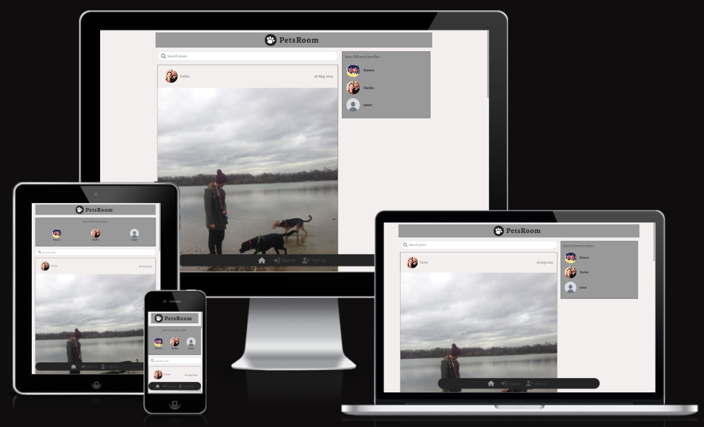

## [Table of content](#table-of-content)
* [UX](#ux)
    * [Site purpose](#site-purpose)
    * [Site goal](#site-goal)
    * [Audiance](#audiance)
    * [Communication](#communicatio)
    * [Current User Goals](#current-user-goals)
    * [New User Goals](#new-user-goals)
    * [Future goals](#future-goals)
* [User Stories](#user-stories)
* [Design](#design)
    * [Colour Scheme](#colour-scheme)
    * [Typography](#typography)
* [Features](#features)
    * [Existing Features](#existing-features)
* [Testing](#testing)
    * [Validator Testing](#validator-testing)
    * [Unfixed Bugs](#unfixed-bugs)
* [Technologies Used](#technologies-used)
    * [Main Languages Used](#main-languages-used)
    * [Frameworks, Libraries & Programs Used](#frameworks-libraries-programs-used)
* [Components](#oomponents)
* [Deployment](#deployment)
* [Credits](#credits)
    * [Content](#content)

## UX

### Site Purpose<span id="site-purpose"><span>:
To bring pet lovers to one place away from common social media about everything.

### Site Goal:
Petsroom is intended to separate mainstream social media and focus only on pets by creating a space for pet lovers to share their bellowed animals.

### Audience:
Everyone who likes animals and would like to scroll only through animal feeds.

### Communication:
With the navigation panel being present at all times, the users can quickly navigate through the site to arrive at their intended destination. In posts section as well as events section, users can communicate with each other through comments.

### Current User Goals:
To keep users coming back for more pets posts and photos.

### New User Goals:
To engage the user with new animal posts and share new articles they have read with other users.

### Future Goals:
* Provide the ability for users to send private messages to either another user, or a group of users.
* To expand the events section & provide a google maps location for each event, so that users may understand in more detail where an even is to be hosted.

## User Stories
I have included links to the [GitHub Issues](https://github.com/DarkoZlatarek/project5-petsroom/issues) for this project, as well as the [KANBAN board](https://github.com/users/DarkoZlatarek/projects/6).

Please also find a full list of the Epics, User stories, & story points typed up [HERE](src/assets/userstories.md).

## Design

### Wireframes:

##### Home Page - Desktop: 

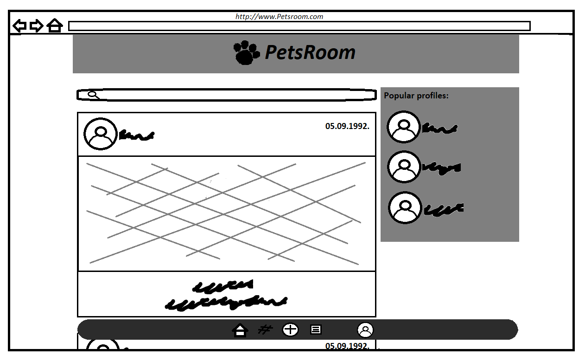

##### Home Page - Mobile: 

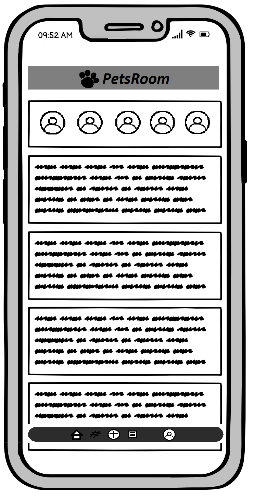

##### Form Page:


##### Site Navigation:

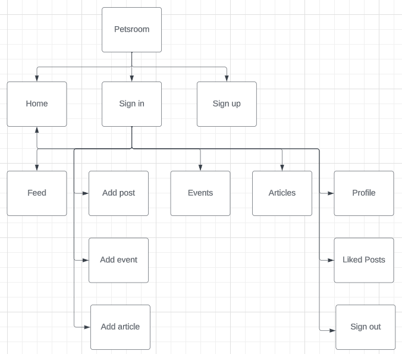

### Database Schema:
This has been uploaded to the Backend README, and can be found [HERE](https://github.com/DarkoZlatarek/petsroom-drf-api/blob/main/static/readme_images/petsroom-database.png).

### Colour Scheme:

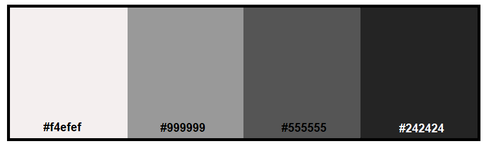

### Typography:
The font chosen for the page is from the Google Fonts:
* Alegreya

## Features

### Existing Features:

#### Header:


##### Navigation - Desktop:

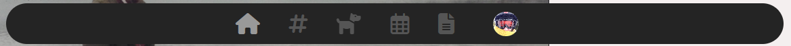

##### Navigation - Mobile:

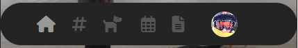

#### Home Page:

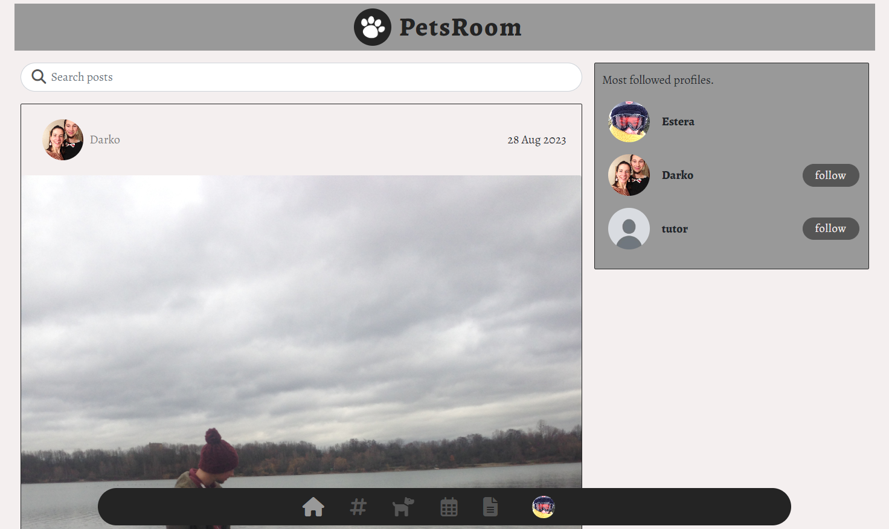

#### Events Page:


#### Articles Page:

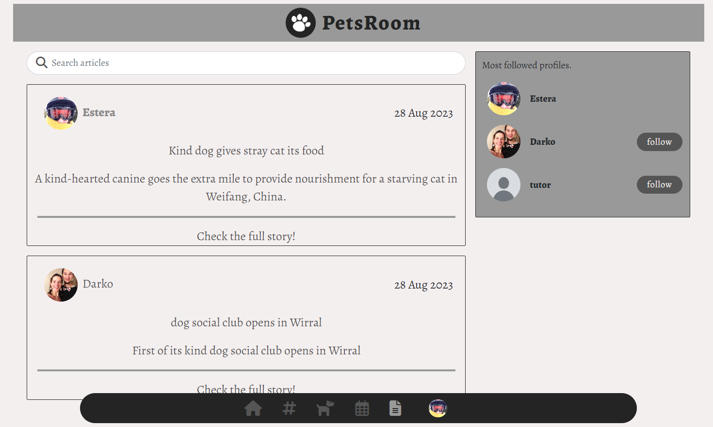

#### Submission Form:

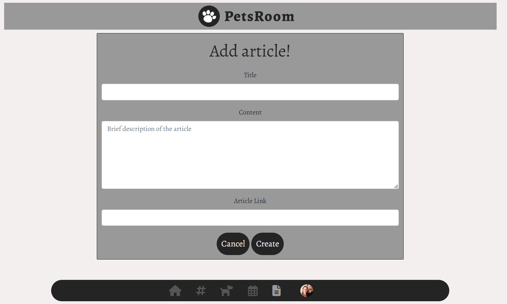

#### Edit Form:

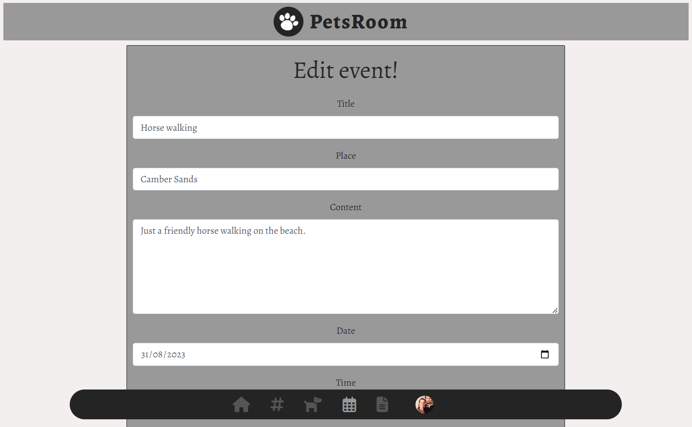

#### 404 Page Not Found:

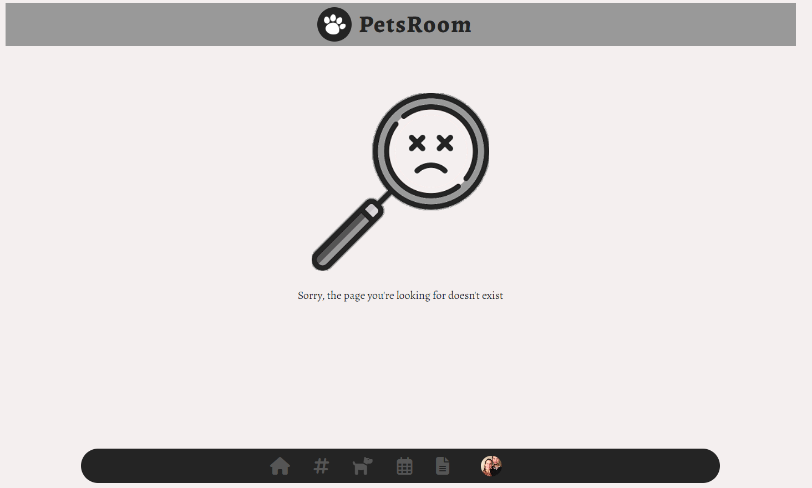

#### Popular Profiles:

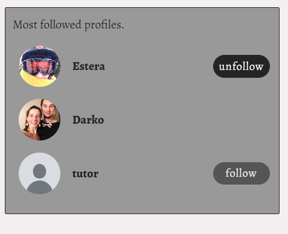

#### Log in, Log out & Sign up:

##### Login:

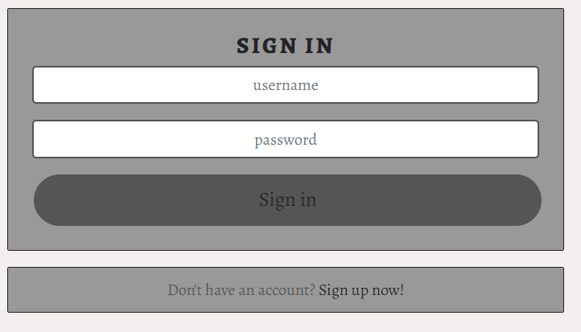

##### Logout:

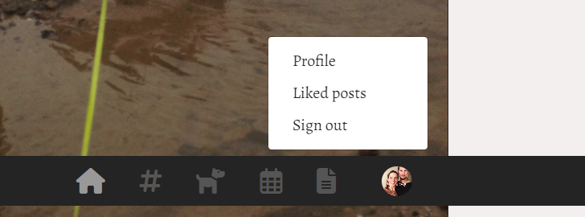

##### Sign-up:

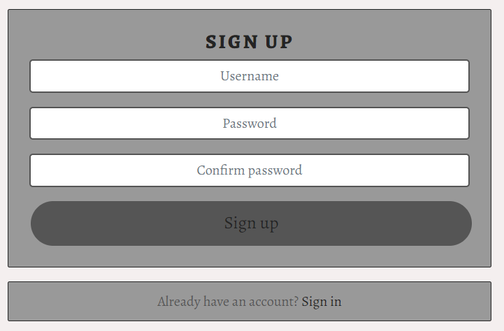

### Features Left to Implement:
* The ability to like articles & events.
* The ability to leave comments on articles.
* Easier access to own created events and articles.
* Notifications when a user receives a new follower, comment, or like.
* Private and group messaging between users.

## Testing

### Manual Testing:
1. The sign up form works without an error when creating a new profile.
2. The sign in form works without an error when signing in to your own account.
3. CRUD functionality has been tested for each of the following: Posts | Articles | Events | Comments | Event comments | Likes | Follow | Profile
 - Likes & Follow may only be created & deleted
 - Profile may only be updated
4. All nav links open to the correct page.
5. Links from article page opens to a new tab.
6. Pages intended for logged-in users only will redirect logged-out users back to the home page.
7. Users attempting to edit content that they did not publish are redirected back to the home page.
10. Each user has the ability to log out.

### Validator Testing
1. CSS files pass through the [Jigsaw validator](https://jigsaw.w3.org/css-validator/) with no issues found.
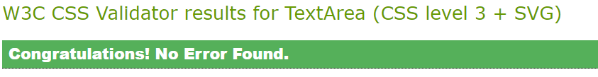

2. All JavaScript files were chacked for Problems inside the gitpod workspace. All came to have no problems apart from App.test.js file. This file contains three warnings that were left by following the moments walkthrough. As this warnings do not affect the overal functionality of the web page, they were ignored. 

3. The page has an excellent Accessibility rating in Lighthouse, but not the performance. According to the Lighthouse this is mainly because of the size of images that are uploaded.

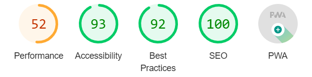

4. Tested the site opens in Chrome and Firefox on desktop - no issues.

5. Tested the site opens in Firefox, Safari and Chrome on mobile device:
* opens and functions withour any error on Firefox, but on Safari and Chrome keeps redirecting me to home page when thrying to log in


### Unfixed Bugs
* log in functionality does not work on mobile Safari and Chrome browsers

## Technologies Used
### Main Languages Used
* HTML5
* CSS3
* Javascript
* Python
* SQL - Postgres

### Frameworks, Libraries & Programs Used
* Google Fonts
* Font Awesome
* GitPod
* GitHub
* Am I Responsive?
* Turbologo
* Django
* React-Bootstrap
* DrawSQL
* LucidChart
* ReactJS

## Components
Several components have been implemented within this project that have been reused throughout the project:
1. axiosDefault.js : for ease of communication with the backend API.
2. Asset.js : to supply the loading spinner & user avatar throughout the site.
3. DropdownMenu.js : to allow users to edit/delete their Articles, Events & Posts.
4. MoreDropdownAddIcon.js : to implement into NavBarMini component as a dropdown for "Add post/event/article"
5. MoreDropdownNavBar.js : to implement into NavBarMini component as a dropdown for "Profile/Liked posts/Sign out"
6. CurrentUserContext.js : confirm users logged-in status to determine what functionality is available to that user.
7. ProfileDataContext.js : provide un/follow ability to other users across PopProf & ProfPage components.
8. useRedirect.js : redirects a user to another page if they are not authorised to be on the page they are trying to access.
9. utils.js : supplies functionality to all of the components that utilise the Infinite Scroll.

## Deployment
The site was deployed to Heroku. The steps to deploy are as follows:
1. Launch the gitpod workspace.
2. Install ReactJS:
```
npx create-react-app . --use-npm
npm start
```
2. Install the following packages using the command `npm install`:
```
react-bootstrap@1.6.3 bootstrap@4.6.0
react-router-dom@5.3.0
axios
react-infinite-scroll-component
msw --save-dev
jwt-decode
```
3. Git add, commit, and push changes to gitpod.
4. Create the project app on Heroku, and link the GitHub repository by navigating to the 'Deploy' tab.

### Connecting to the API:
1. Navigated to the Heroku app of the project DRF-API, and under the Settings tab, added the following configvars:
- Key: CLIENT_ORIGIN | Value: https://react-app-name.herokuapp.com
- Key: CLIENT_ORIGIN_DEV | Value: https://gitpod-browser-link.ws-eu54.gitpod.io
2. Check that the trailing slash `/` at the end of both links has been removed, and save the configvar pairs.
3. Install the Axios package, & create supporting `axiosDefaults.js` as shown in [Moments Walkthrough](https://github.com/Code-Institute-Solutions/moments/blob/cf955d2f2e6f70f61c92d1f9de85558d8e49f3a8/src/api/axiosDefaults.js).

### Deploy to Heroku:
1. In the `scripts` section of `package.json` in gitpod, added the following command:
```
"heroku-prebuild": "npm install -g serve",
```
2. Add Procfile to project root & populate with the following:
```
web: serve -s build
```
3. Repeat the steps of git add/commit/push.
4. Deploy the project via the deploy button on Heroku.

## Credits

### Content
* Estera Zlatarek - My amazing wife who accepted not to spend time with me because of my coding whole day, bringing me food and drinks to stay fed and hydrated.
* Code Institute: The creation of the project came to life by utilising the Moments walkthrough step-by-step as a base foundation, and then building upon it to make the project my own.
* [Tom Ainsworth](https://github.com/Tom-Ainsworth): A fellow student & friend who consistently helped me with troubleshooting when needed.
* Mitko Bachvarov : My tutor who provided me with guidance for the project and constant support whenever needed - answering my questions even when on holiday.
* Tutor support team - huge help in the final stages of the project for troubleshooting any issues.
* [Lauren-Nicole](https://github.com/CluelessBiker): Used her [README.md](https://github.com/CluelessBiker/project5-red-crayon/blob/main/README.md) from her PP5 as a template for my own.
* Paint - good old paint where I created wireframes and color palette.