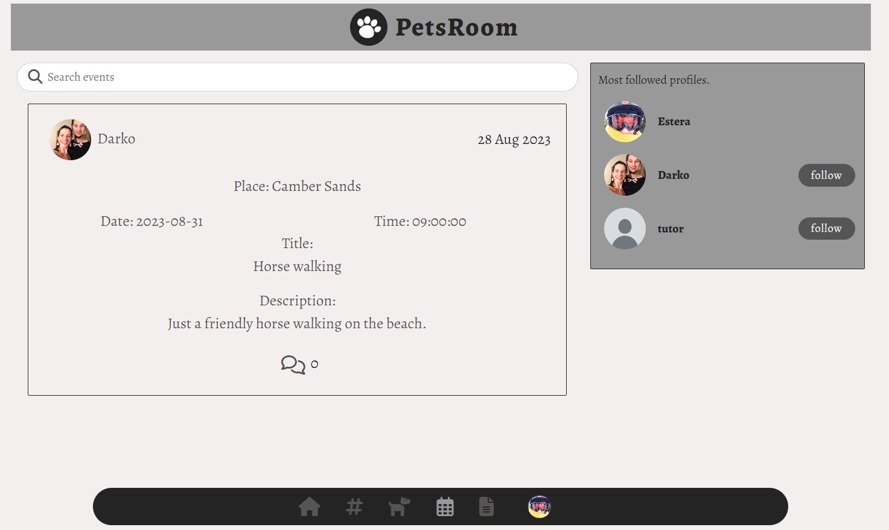

# Petsroom
The Petsroom is a social media platform for pet lovers. Here, users can share their belowed pets photos, arrange meetup events with other users and share interesting articles relating animals that might interest other users. Users can also interact with each other by commenting on posts or events.

- The repository for the DRF-API associated with this project is available [HERE](https://github.com/DarkoZlatarek/petsroom-drf-api). The installation, set up, and deployment steps for this section of the project have been included in the README linked to the DRF-API. 

#### DEPLOYED BACKEND API PAGE - [LINK](https://petsroom-drf-api-11e537707187.herokuapp.com/)
#### DEPLOYED FRONTEND - [LIVE PAGE](https://petsroom-478d60bcd402.herokuapp.com/)
#### DEPLOYED FRONTEND - [REPOSITORY](https://github.com/DarkoZlatarek/project5-petsroom)


## [Table of content](#table-of-content)
* [UX](#ux)
    * [Site purpose](#site-purpose)
    * [Site goal](#site-goal)
    * [Audiance](#audiance)
    * [Communication](#communicatio)
    * [Current User Goals](#current-user-goals)
    * [New User Goals](#new-user-goals)
* [User Stories](#user-stories)
    * [Admin stories](#admin-stories)
    * [Artist stories](#artist-stories)
    * [Visitor stories](#visitor-stories)
* [Design](#design)
    * [Typography](#typography)
    * [Colour Scheme](#colour-scheme)
    * [Imagery](#imagery)
* [Features](#features)
    * [Existing Features](#existing-features)
    * [C.R.U.D](#crud)
* [Testing](#testing)
    * [Validator Testing](#validator-testing)
    * [Unfixed Bugs](#unfixed-bugs)
* [Technologies Used](#technologies-used)
    * [Main Languages Used](#main-languages-used)
    * [Frameworks, Libraries & Programs Used](#frameworks-libraries-programs-used)
* [Components](#oomponents)
* [Deployment](#deployment)
* [Credits](#credits)
    * [Content](#content)
    * [Media](#media)

## UX

### Site Purpose<span id="site-purpose"><span>:
To bring pet lovers to one place away from common social media about everything.

### Site Goal:
Petsroom is intended to separate mainstream social media and focus only on pets by creating a space for pet lovers to share their belowed animals.

### Audience:
Everyone who likes animals and would like to scroll only through animal feeds.

### Communication:
With the navigation panel being present at all times, the users can quickly navigate through the site to arrive at their intended destination. In posts section as well as events section, users can communicate with each other through comments.

### Current User Goals:
To keep users coming back for more pets posts and photos.

### New User Goals:
To engage the user with new animal posts and share new articles they have read with other users.

### Future Goals:
* Provide the ability for users to send private messages to either another user, or a group of users.
* To expand the events section & provide a google maps location for each event, so that users may understand in more detail where an even is to be hosted.

## User Stories
I have included links to the [GitHub Issues](https://github.com/DarkoZlatarek/project5-petsroom/issues) for this project, as well as the [KANBAN board](https://github.com/users/DarkoZlatarek/projects/6).

Please also find a full list of the Epics, User stories, & story points typed up [HERE](src/assets/userstories.md).

## Design

### Wireframes:

##### Home Page - Desktop: 


##### Home Page - Mobile: 


##### Form Page:


##### Site Navigation:


### Database Schema:
This has been uploaded to the Backend README, and can be found [HERE](https://github.com/DarkoZlatarek/petsroom-drf-api/blob/main/static/readme_images/petsroom-database.png).

### Colour Scheme:


### Typography:
The font chosen for the page is from the Google Fonts:
* Alegreya

## Features

### Existing Features:

#### Header:


##### Navigation - Desktop:


##### Navigation - Mobile:


#### Home Page:


#### Events Page:



#### Articles Page:


#### Submission Form:


#### Edit Form:


#### 404 Page Not Found:


#### Popular Profiles:


#### Log in, Log out & Sign up:

##### Login:


##### Logout:


##### Sign-up:


### Features Left to Implement:
* The ability to like articles & events.
* The ability to leave comments on articles.
* Easier access to own created events and articles.
* Notifications when a user receives a new follower, comment, or like.
* Private and group messaging between users.

## Testing

### Manual Testing:
1. The sign up form works without an error when creating a new profile.
2. The sign in form works without an error when signing in to your own account.
3. CRUD functionality has been tested for each of the following: Posts | Articles | Events | Comments | Event comments | Likes | Follow | Profile
 - Likes & Follow may only be created & deleted
 - Profile may only be updated
4. All nav links open to the correct page.
5. Links from article page opens to a new tab.
6. Pages intended for logged-in users only will redirect logged-out users back to the home page.
7. Users attempting to edit content that they did not publish are redirected back to the home page.
10. Each user has the ability to log out.

### Validator Testing
1. CSS files pass through the [Jigsaw validator](https://jigsaw.w3.org/css-validator/) with no issues found.


2. All JavaScript files were chacked for Problems inside the gitpod workspace. All came to have no problems apart from App.test.js file. This file contains three warnings that were left by following the moments walkthrough. As this warnings do not affect the overal functionality of the web page, they were ignored. 

3. The page has an excellent Accessibility rating in Lighthouse, but not the performance. According to the Lighthouse this is mainly because of the size of images that are uploaded.


4. Tested the site opens in Brave, Chrome, Safari & on a mobile device without issues.

5. All social links open to external pages as intended.

### Unfixed Bugs
Whilst it is not technically a bug, I would like to add that I am not entirely satisfied with the header of the site on mobile devices. Increasing the font size to make it stand out, causes the burger icon to shift onto a new line, which takes up too much real estate on the screen. I had attempted early on to separate out the components & have them be independent of each-other, however this then presented a new issue. When shrinking the size of the burger icon, this also shrank the expanding window, which cut off the navigation items. I was unable to ascertain how to target the exact style rule imposed by React-Bootstrap to over ride this and expand the display window, and instead compromised by implementing a smaller font-size into my heading.

## Technologies Used
### Main Languages Used
- HTML5
- CSS3
- Javascript
- Python
- SQL - Postgres

### Frameworks, Libraries & Programs Used
- Google Fonts : For the site fonts.
- Font Awesome : To add icons to the social links in the footer & navigation sections.
- GitPod : To build the project & create the JSX & CSS files before pushing the project to Github.
- GitHub : To store my repository for submission.
- Balsamiq : Was used to create mockups of the project prior to starting.
- Am I Responsive? : To ensure the project looked good across all devices.
- Favicon : To provide the code & image for the icon in the tab bar.
- Django : Used to build the backend database that serves as an API for the front-end project.
- React-Bootstrap : The styling library that has aided to the layout of the site, and which was introduced to us during the course of the program.
- DrawSQL : An interactive tool that allows for the creation of Database mock-ups so that we can visualise the relationships between models.
- ReactJS : To build the components that would collectively form the front-end application.

## Components
Several components have been implemented within this project that have been reused throughout the project:
1. axiosDefault.js : for ease of communication with the backend API.
2. Asset.js : to supply the loading spinner & user avatar throughout the site.
3. DropdownMenu.js : to allow users to edit/delete their Articles, Events & Posts.
4. CurrentUserContext.js : confirm users logged-in status to determine what functionality is available to that user.
5. ProfileDataContext.js : provide un/follow ability to other users across PopProf & ProfPage components.
6. ToggleCollapse.js : whilst this component has only been applied to the NavBarMini, it could in theory be applied to additional dropdown menus installed into the site in the future to allow for the automatic collapse of an element upon mouse click.
7. useRedirect.js : redirects a user to another page if they are not authorised to be on the page they are trying to access.
8. utils.js : supplies functionality to all of the components that utilise the Infinite Scroll.

## Deployment
The site was deployed to Heroku. The steps to deploy are as follows:
1. Launch the gitpod workspace.
2. Install ReactJS:
```
npx create-react-app . --use-npm
npm start
```
2. Install the following packages using the command `npm install`:
```
react-bootstrap@1.6.3 bootstrap@4.6.0
react-router-dom@5.3.0
axios
react-infinite-scroll-component
msw --save-dev
jwt-decode
-g eslint
```
3. Git add, commit, and push changes to gitpod.
4. Create the project app on Heroku, and link the GitHub repository by navigating to the 'Deploy' tab.

### Connecting to the API:
1. Navigated to the Heroku app of the project DRF-API, and under the Settings tab, added the following configvars:
- Key: CLIENT_ORIGIN | Value: https://react-app-name.herokuapp.com
- Key: CLIENT_ORIGIN_DEV | Value: https://gitpod-browser-link.ws-eu54.gitpod.io
2. Check that the trailing slash `\` at the end of both links has been removed, and save the configvar pairs.
3. Install the Axios package, & create supporting `axiosDefaults.js` as shown in [Moments Walkthrough](https://github.com/Code-Institute-Solutions/moments/blob/cf955d2f2e6f70f61c92d1f9de85558d8e49f3a8/src/api/axiosDefaults.js).

### Deploy to Heroku:
1. In the `scripts` section of `package.json` in gitpod, added the following command:
```
"heroku-prebuild": "npm install -g serve",
```
2. Add Procfile to project root & populate with the following:
```
web: serve -s build
```
3. Repeat the steps of git add/commit/push.
4. Deploy the project via the deploy button on Heroku.

### Deploy to Render & ElephantSQL:
* Due to Heroku revoking their frie tier access, the project has been redeployed using (Render)[https://render.com/] & (ElephantSQL)[https://www.elephantsql.com/] using the following [instructions](https://code-institute-students.github.io/deployment-docs/41-pp5-adv-fe/pp5-adv-fe-drf-01-create-a-database)

## Credits

### Content
- Code Institute: The creation of the project came to life by utilising the Moments walkthrough step-by-step as a base foundation, and then building upon it to make the project my own. This is evident from the numerous docstrings within my files crediting the walkthrough.
- [Mats Simonsson](https://github.com/Pelikantapeten): A fellow student & friend who consistently helps me to troubleshoot when needed, supports me constantly, and is my rubber duck.
- [Martina Terlevic](https://github.com/SephTheOverwitch): A constant support system, providing reassurance, and the ability to calm me down.
- [BobbyHadz](https://bobbyhadz.com/blog/react-you-are-importing-createroot-from-react-dom#:~:text=The%20error%20%22You%20are%20importing,js%20.): provided the answer on how to resolve a console error indicating that the createRoot render was not compatible with the current version of ReactJS.
- Two events have been added to the site. The content for these was taken from the [Stavros Niarchos Foundation](https://www.snfcc.org/en/events), and the [Meet Market](https://www.themeetmarket.gr/en/). Each event has also been credited within the content body.

### Media
- 404 Error Graphic from [PNG Tree](https://pngtree.com/freepng/404-error-interface-art-word-design_4043816.html)
- Images for the Articles, Events & Posts mad